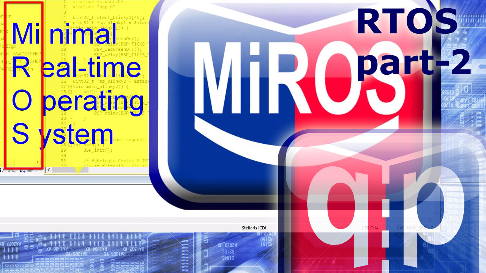
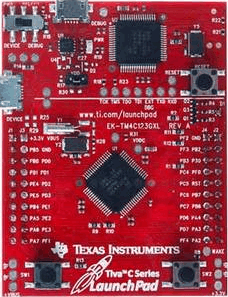
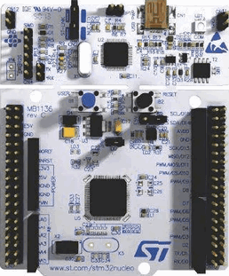

## Brought to you by:
[](https://www.state-machine.com)

# What is it?
[](https://github.com/QuantumLeaps/MiROS/releases/latest)
[](https://github.com/QuantumLeaps/MiROS/blob/master/LICENSE)

"MiROS" is a Minimal Real-Time Operating System (RTOS) kernel for ARM Cortex-M.
It supports preemptive, priortity-based multithreading, fully compliant with
RMA/RMS (Rate-Monotonic Analysis/Scheduling).

>NOTE<br>
MiROS is a teaching aid used in the ["Modern Embedded Programming" video course
on YouTube](https://www.youtube.com/playlist?list=PLPW8O6W-1chyrd_Msnn4LD6LBs2slJITs)

The main goal of the MiROS kernel is to illustrate the concepts underlying
Real-Time Operating Systems (RTOS). The aim here  is simplicity and clear
presentation of the concepts, but without dealing with various corner cases,
portability, or error handling. For these reasons, the software is generally
NOT intended or recommended for use in commercial\applications.

[](https://youtu.be/PKml9ki3178)


# Supported Toolchains
MiROS is available for the following embedded toolchains:
- ARM/KEIL MDK (uVision)
- GNU-ARM (Makefile projects)
- IAR EWARM

# Supported Embedded Boards
Currently, MiROS examples are available for the following embedded boards:

- EK-TM4C123GXL (TivaC LaunchPad)

<p align="center"></p>

- STM32 NUCLEO-L152RE

<p align="center"></p>


# Directories and Files
```
MiROS/
+---3rd_party/         - third-party software (needed in the examples)
|   +---CMSIS/         - ARM CMSIS
|   +---ek-tm4c123gxl/ - low-level code to support EK-TM4C123GX board
|   +---nucleo-l152re/ - low-level code to support STM32 NUCLEO L152RE board
|
+---examples/
|   +---blinky_ek-tm4c123gxl/ - Blinky exammple for EK-TM4C123GX board
|   |   +---armclang/         - project for ARM/KEIL uVision with ARMCLANG
|   |   +---gnu/              - project for GNU-ARM with simple Makefile
|   |   +---iar/              - project for IAR EWARM
|   |
|   +---blinky_nucleo-l152re/ - Blinky exammple for STM32 NUCLEO-L152RE
|       +---armclang/         - project for ARM/KEIL uVision with ARMCLANG
|       +---gnu/              - project for GNU-ARM with simple Makefile
|       +---iar/              - project for IAR EWARM
|
+---include/           - include directory
|       miros.h        - MiROS API
+---src/               - MiROS source code
|   +---armclang/
|   |      miros.c     - MiROS implementation for ARMCLANG
|   +---gnu/
|   |      miros.c     - MiROS implementation for GNU-ARM
|   +---iar/
|   |      miros.c     - MiROS implementation for IAR EWARM
```


# Building the Examples
MiROS comes with the "Blinky" examples for the boards listed above.

To build and run the examples, inside the "examples" directory select
the "Blinky" version for your board and then, inside that sub-directory
select the toolchain (ARMCLANG, GNU-ARM, or IAR). That sub-directory
contains the project that you can open with the IDE (uVision or IAR).
The GNU-ARM project consists of a simple Makefile, which you can run
from the command-line.


# Licensing
MiROS is [licensed](LICENSE) under the GPLv3 open source license.


# Comments/Discussion
If you'd like to discuss MiROS or related subjects, plese use the ["Issues" tab](https://github.com/QuantumLeaps/MiROS/issues).


# How to Help this Project?
If you like this project, please give it a star (in the upper-right corner of your browser window):


# Contact Information
[state-machine.com](https://www.state-machine.com/video-course)
